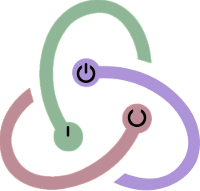

#  REDUX ON/OFF



This repository contains `redux-onoff` source code and currently hosted on `Github`.
The main purpose of `redux-onoff` is to easily set toggle options to components
connected to a Redux store.

It will be very useful for components like dialog window, switch button and etc.

## Installation

- yarn

  ```shell
  yarn add redux-onoff
  ```

- npm

  ```shell
  npm install redux-onoff
  ```

## Getting Started

```javascript

// in src/some/reducer.js
import { hor } from "redux-onoff";

const counterInit = { counter: 0 };
const someReducer = (state = counterInit, action = {}) => { ... };
export const newSomeReducer = hor("some")(someReducer);

// in src/App.js
import React, { Component } from "react";
import { connect } from "react-redux";
import { bindActionCreators } from "redux";
import { toggleAction, setAction } from "redux-onoff";
import * as actions from "./yourReduxActions";

class App extends Component {
  ...
}

export default connect(
  mapStateToProps,
  dispatch => bindActionCreators(
    {
      ...actions,
      toggleWindow: toggleAction("some"),
    },
    dispatch
  )
)(App);
```